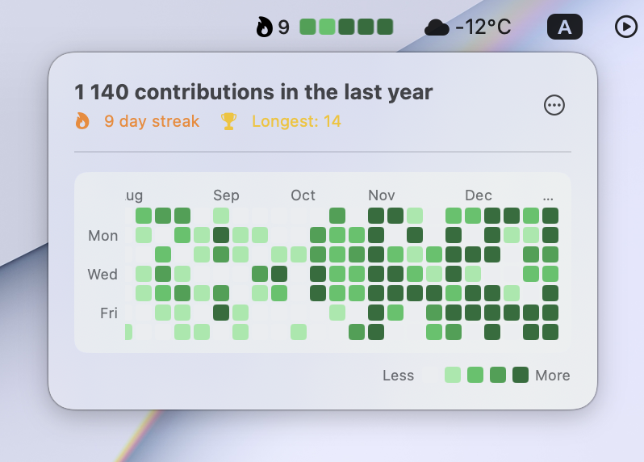
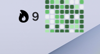
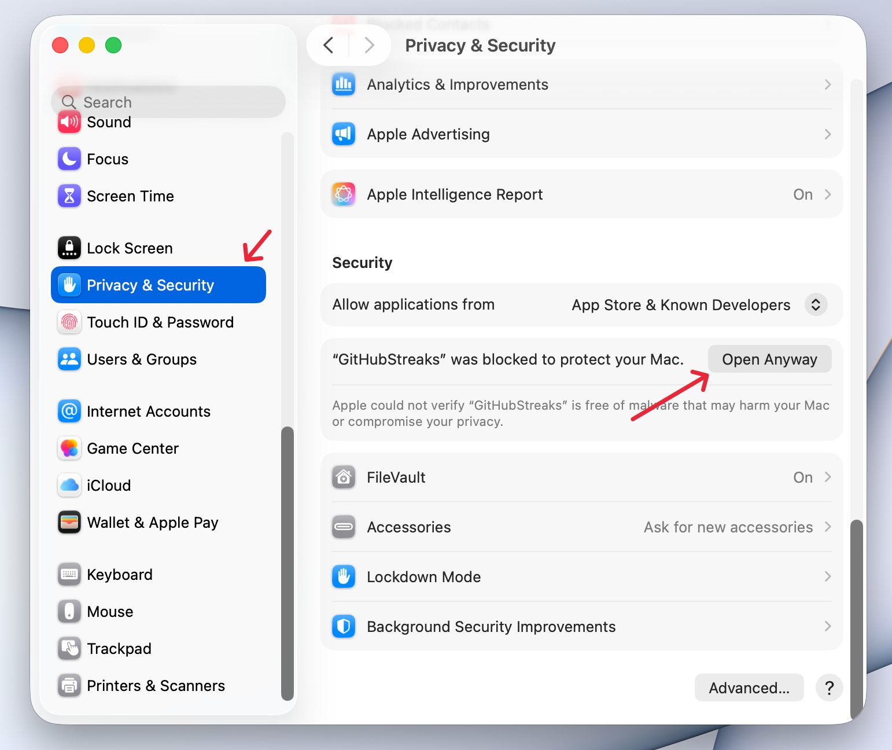
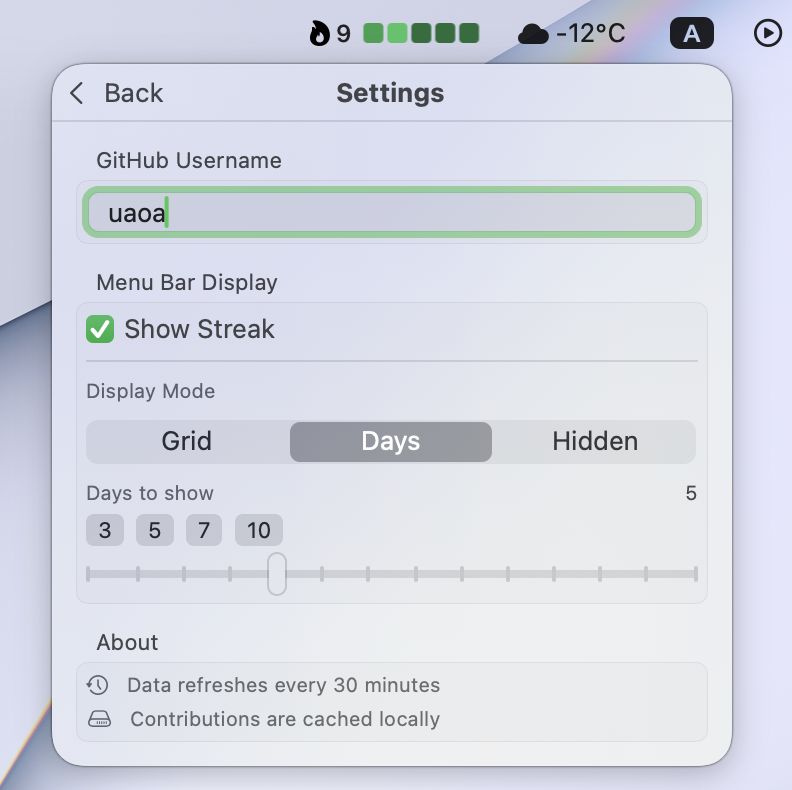
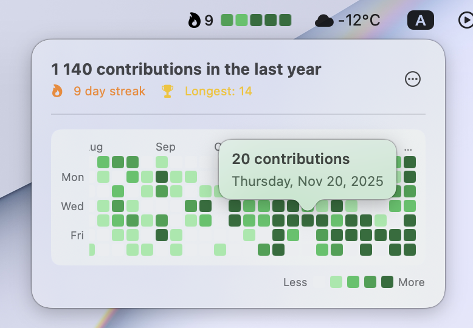

# GitHub Streaks

A minimalist macOS menu bar app that displays your GitHub contribution streak.

[](https://github.com/uaoa/github-streaks/releases/latest/download/GitHubStreaks.dmg)
[](https://github.com/uaoa/github-streaks)
[](https://github.com/uaoa/github-streaks)
[](LICENSE)



## Features

- **Streak Counter** — See your current streak at a glance
- **Mini Grid** — Visual overview of recent contributions in the menu bar
- **Full Year View** — Click to see your complete contribution graph
- **Customizable Display** — Show streak, grid, or both
- **Native macOS Design** — Feels right at home on your Mac



## Installation

### Download (Recommended)

1. Go to [Releases](https://github.com/uaoa/github-streaks/releases/latest)
2. Download `GitHubStreaks.dmg` or `GitHubStreaks.zip`
3. Open the DMG and drag the app to Applications, or unzip and move to Applications
4. Launch the app and enter your GitHub username

### Unverified App Warning

Since the app is not signed with an Apple Developer certificate, macOS will show a warning when you first open it.

**Option 1: Right-click to open**
- Right-click (or Control-click) on the app and select "Open"
- Click "Open" in the dialog

**Option 2: Allow in System Settings**

If you see "GitHubStreaks was blocked":

1. Open **System Settings** > **Privacy & Security**
2. Scroll down to find "GitHubStreaks was blocked to protect your Mac"
3. Click **Open Anyway**



## Setup

After launching, click on the menu bar icon and go to Settings:

1. Enter your GitHub username
2. Choose display mode (Grid, Days, or Hidden)
3. Optionally enable "Show Streak" to display your current streak



## Usage

- **Click** on the menu bar icon to see your full contribution graph
- **Hover** over any day to see contribution details



### Build from Source

Requirements:
- macOS 14.0+
- Xcode 15.0+

```bash
# Clone the repository
git clone https://github.com/uaoa/github-streaks.git
cd github-streaks

# Open in Xcode
open GitHubStreaks.xcodeproj

# Or build from command line
xcodebuild -project GitHubStreaks.xcodeproj \
  -scheme GitHubStreaks \
  -configuration Release \
  -derivedDataPath build \
  CODE_SIGN_IDENTITY="-" \
  CODE_SIGNING_REQUIRED=NO

# The app will be in build/Build/Products/Release/GitHubStreaks.app
```

### Create DMG (Optional)

```bash
# After building, create a DMG for distribution
hdiutil create -volname "GitHubStreaks" \
  -srcfolder build/Build/Products/Release/GitHubStreaks.app \
  -ov -format UDZO \
  GitHubStreaks.dmg
```

## Requirements

- macOS 14.0+

## Privacy

GitHub Streaks only fetches your public contribution data. No authentication required. No data stored remotely.

## License

This project is licensed under the MIT License - see the [LICENSE](LICENSE) file for details.

## Contributing

Contributions are welcome! Please feel free to submit a Pull Request.

1. Fork the repository
2. Create your feature branch (`git checkout -b feature/amazing-feature`)
3. Commit your changes (`git commit -m 'Add some amazing feature'`)
4. Push to the branch (`git push origin feature/amazing-feature`)
5. Open a Pull Request

---

*Built for developers who ship.*
